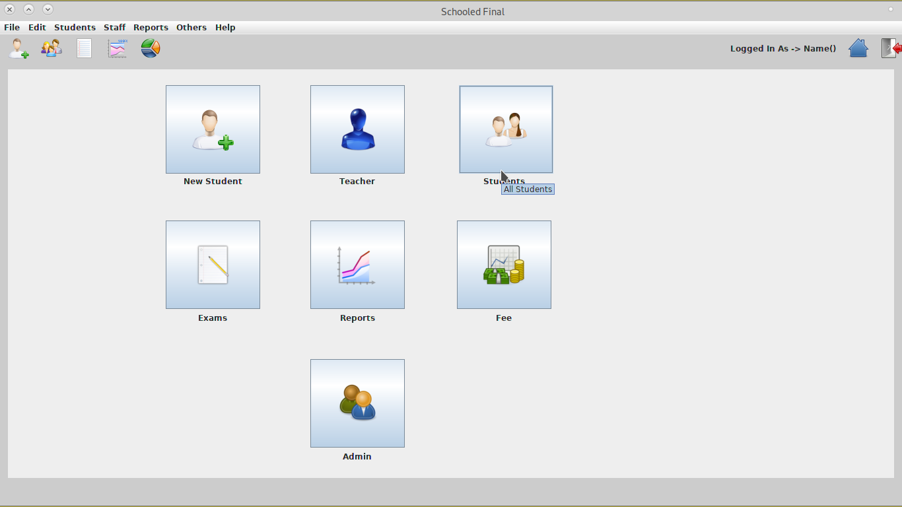

## **Work Description**

This is a simple project formerly designed for my secondary school.

## Aims

1. Automate the work processing of exam results.
2. Speed up processing students results sheets.
3. Remove the possibility of math errors in students result sheets


## Setting up MrkFinal 

To set up this program you'll need to have the following requirements ready in your PC/Workstation

- Java JDK
- A MySQL instance


## Running MrkFinal 

To execute this first clone this repository

```
git clone 
```

then run 

```
java -jar dist/MrkFinal.jar 
```


## How it Works

1. ### Start Screen

   The application starts by  loading the default login screen. This screen has the privilege level for both *Teacher* and *Admin*.

   The Screen is as shown below

   

   

2. ### DashBoard

   Once correct credentials habe been provided the dasboard is presented.

   It has all the links to other logic instances such as 

   ​	*Add Student*  -> This instance adds a student to the database.

   ​	*Teacher* -> This instance used by the teacher to insert student marks.

   ​	*Student*  -> This instance displays student's info.

   ​	*Exam*  -> This instance show the performances of student as per the marks the teacher inserted. It  has the logic like comparison etc

   ​	*Report*  -> This instance has the logic that does work like printing results slips.

   ​	*Fee*  -> This instance has the fee logic in it. The arrears and over payments are all here.

   ​	*Add Student*  -> This instance has the admin privileges. the configuration this program are done here.

   The board is as below

   ​		

   

   

3. ### Teacher

   This has the logic that insert students marks to the database.

   it has several GUI instances depending on the form selected. for Junior forms all subjects a presumed to be examinable to all students hence many rows provided, Rather to senior forms the teacher has to select the subject 		

   

   ​		 ***Junior forms***

   ​		

   ​		 ***Senior forms***

   ​		

   

4. ### Exams

   This is split into two tabs Comparison tab and Sorting tab.

   ​	*Comparison tab*: shows how the exam was results are, This also has some constraints that can be 			tweaked so as to show differences between last exam and current exam.

   ​	

   ​	*Sorting tab*: This also has some constraints (But more finer) that can be tweaked so as to show exam 		result in different ways

   ​	

5. ### Reports

   This deals with report generation and also visualizations.

   For any data to be processed ensure a class(form) is selected and press the load button, Then the resulting rendered table is ready to be your data selection source (Done by selecting any row in the table).

   Sample visualization include bar graph and a line graph.

   

   

   Report(Result) sheets  are also rendered and can be generated for a the whole lot or one.

   ​	

6. ### Fee

   This is further subdivided int 3 tabs.

   ​	*Fee Statement Tab*:  This shows fee objects and the assigned amount. This is done for all classes.

   ​		

   ​	*Arrears Tab*:  This shows fee arrears and fee paid of all students. Also has a search feature if the 			number of student is very long.

   ​			

   ​	*Deposits Tab*:  This shows fee arrears and fee paid of all students. Also has a search feature that sorts 			by amount paid.

   ​			The other logic is the pay module this enable the system user to register new fee payment.

   ​			

   

7. ### Admin

   This button is the link to the System configurations.

   it has the following capabilities to itself

   ​	*Add tables* : This makes the database to be clean by not cluttering a single table.

   ​						It has a create new table into the database . THIS most  recent table is user for the new transactions namely the exams.

   ​		

   ​	*Transfers* : this is the feature the pushes the student to the next class. Basses on the pass mark criteria

   

   ​	*Grading* : This has the module that lets the admin to make the grading of the choice opted.

   ​			

   ​	*Fee statement* : This create new fee object and assigns an amount to it.

   ​				

